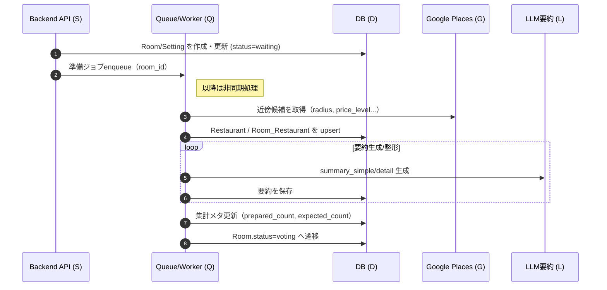
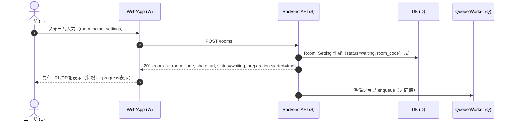
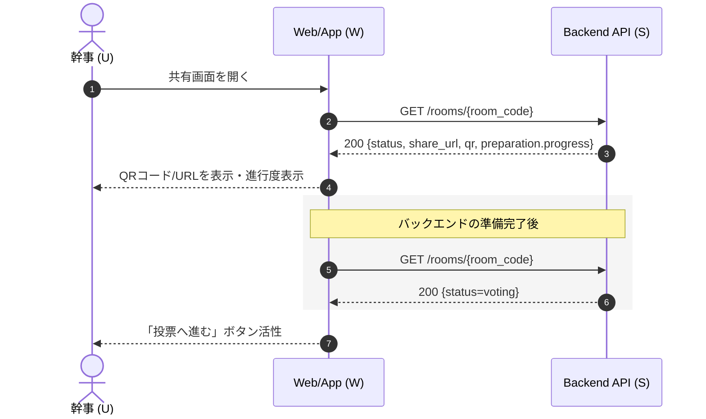
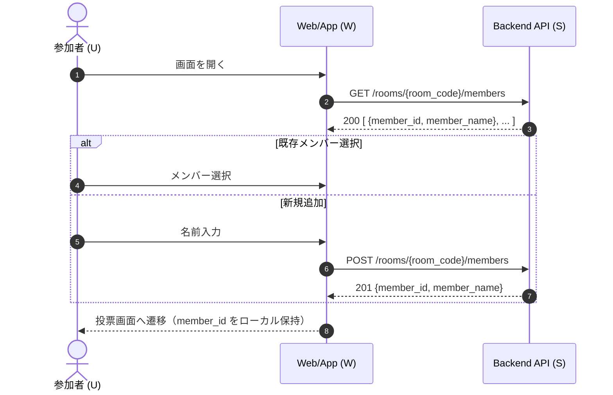
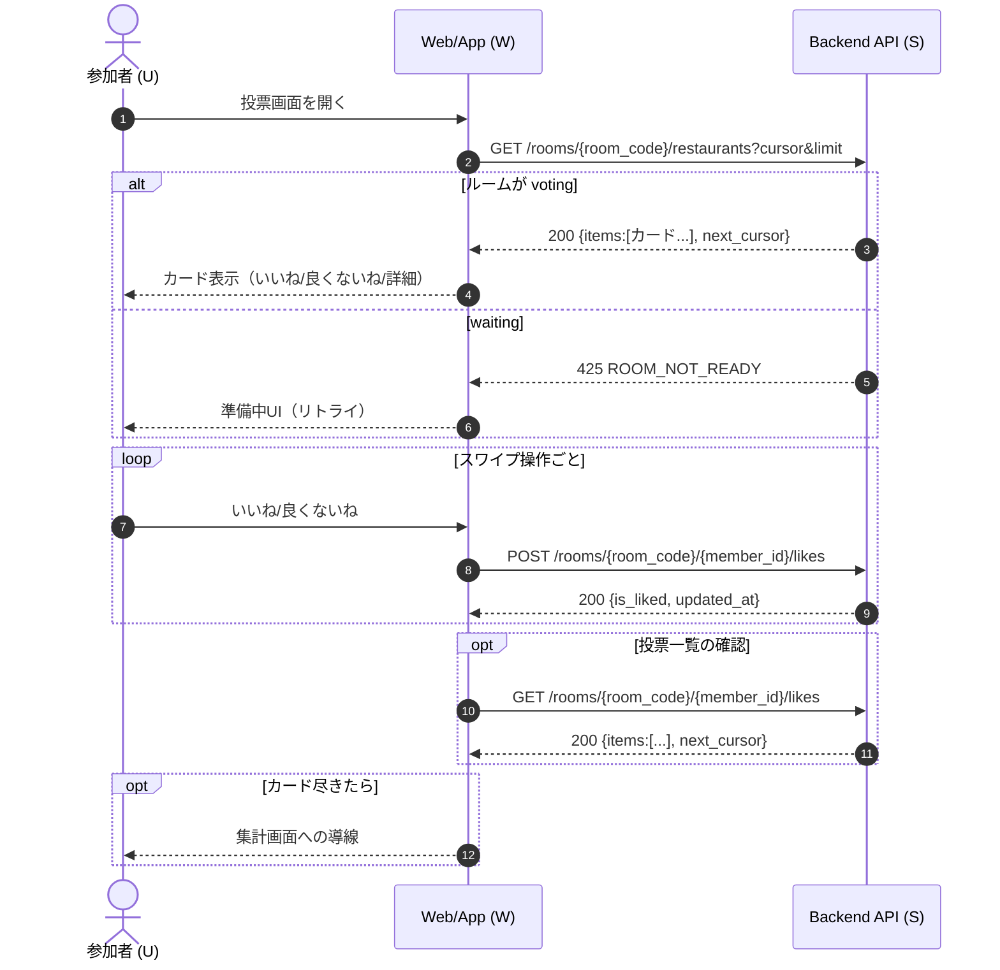
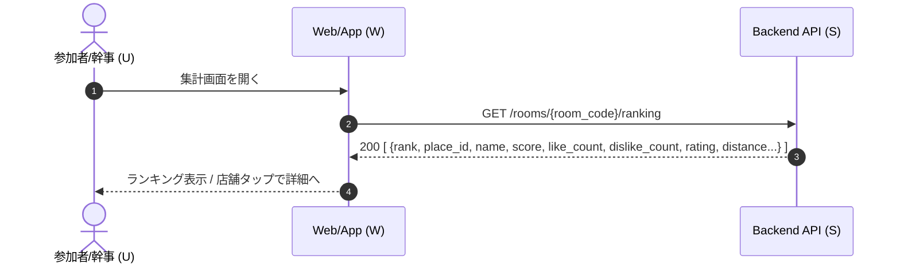
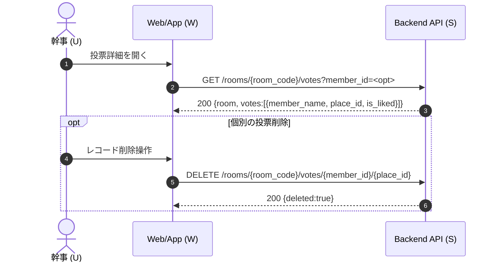
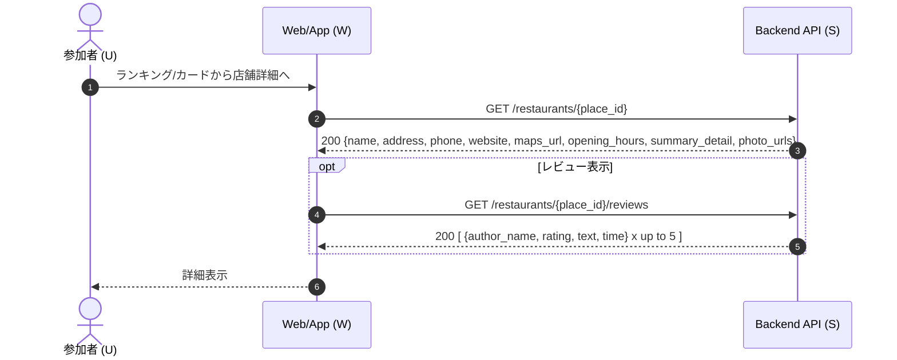
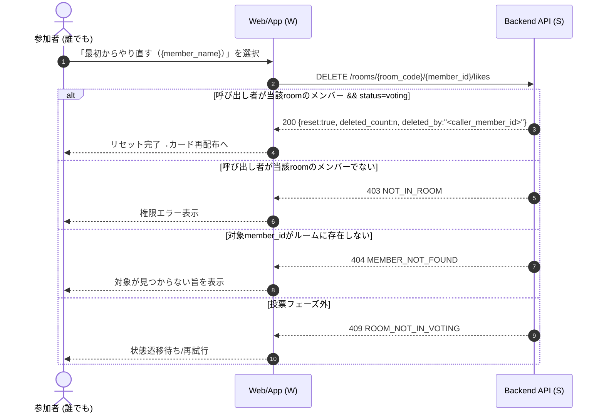

# MogFinder シーケンス図（画面別フロー)

> 前提：各図は ユーザ（U） と システム（W=Web/App, S=Backend, Q=Queue/Worker, D=DB, G=Google Places, L=LLM） のやりとりを示します。
> 
> 
> API名はメッセージ内に明記。
> 

---

## 0. 準備ジョブ（非同期：`POST /rooms` または `PATCH /settings` 後）

---

## 1. グループ作成画面（ルーム新規作成）

---

## 2. グループシェア画面（待機〜投票開始）

---

## 3. メンバー選択/新規追加画面（ログイン不要・セッション発行）

---

## 4. 投票（マチアプ式）画面

---

## 5. グループ集計画面（ランキング）

---

## 6. 投票詳細の確認/編集（管理用）

---

## 7. 店舗詳細/レビュー画面

---

## 8. 投票をリセット（やり直し）

---
