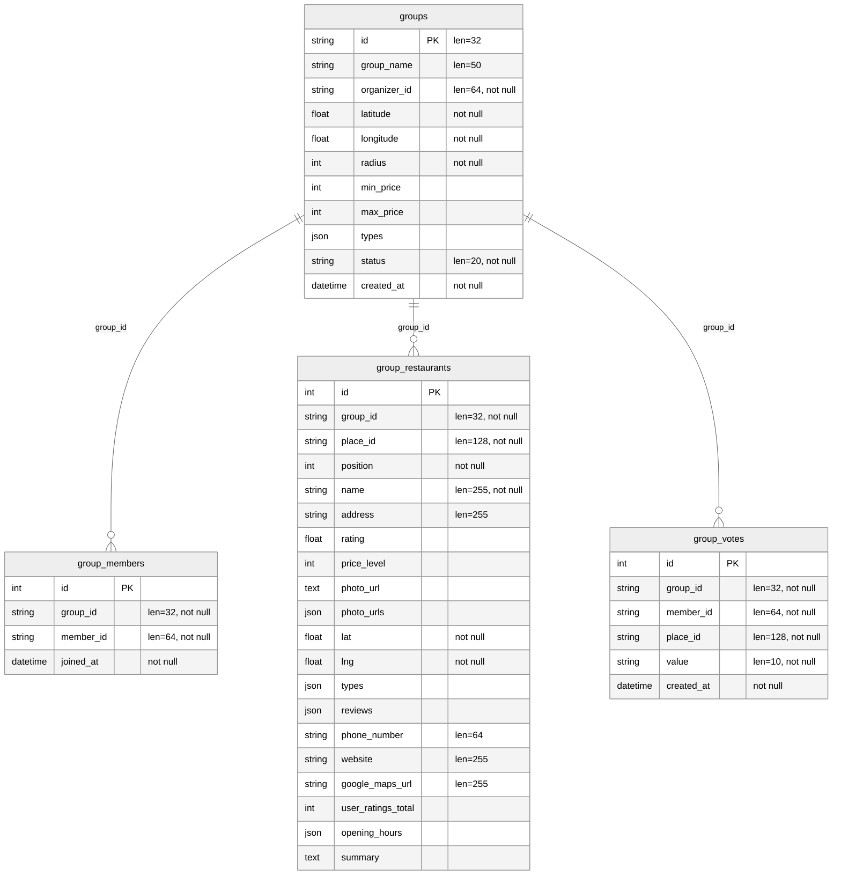

# 開発ドキュメント

## データベース ER 図
- Mermaid 図ファイル: [`schema.mmd`](./schema.mmd)
- DBML ファイル: [`schema.dbml`](./schema.dbml)
- 表示方法: dbdiagram.io などの DBML 対応ツールに上記ファイルを読み込むと ER 図として閲覧できます。
- 更新手順（プロジェクトルートで実行）:
  ```bash
  python3 -m venv .venv
  source .venv/bin/activate
  pip install -r backend/requirements.txt
  python scripts/generate_dbdiagram.py
  ```
  CI でも自動生成され、差分が残っている場合はジョブが失敗します。
- GitHub 上でも以下の Mermaid 図から直接確認できます。
<!-- BEGIN ER MERMAID -->

<!-- END ER MERMAID -->

## API ドキュメント
- Swagger UI HTML: [`api/swagger.html`](./api/swagger.html)
- OpenAPI JSON: [`api/openapi.json`](./api/openapi.json)
- GitHub 上でのクイックプレビュー（`main` ブランチ）:  
  https://htmlpreview.github.io/?https://raw.githubusercontent.com/jphacks/os_2504/main/documents/api/swagger.html
- 更新手順（プロジェクトルートで実行）:
  ```bash
  python backend/scripts/export_swagger.py
  ```
  ※ 互換ラッパーとして `python scripts/generate_api_docs.py` でも同じ成果物が生成できます。  
  こちらも CI が生成＆差分検知を行います。

## 補足
- スクリプトはルート直下の `scripts/` に配置されています。
- `schema.dbml` や `api/` 以下の成果物はリポジトリにコミットし、常に最新状態を保つようにしてください。
